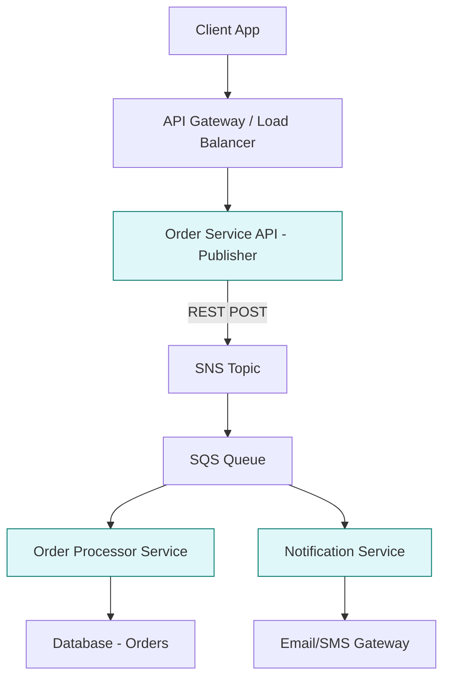
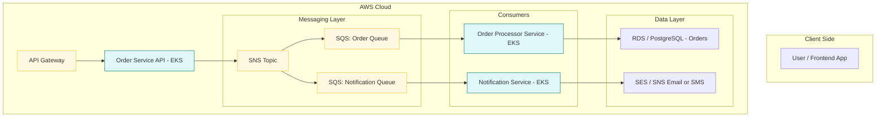

# 📦 Order Hub

A modular, event-driven **Spring Boot** microservices architecture that simulates stock order processing using **REST APIs**, **AWS SNS/SQS**, and **LocalStack** for local development and testing.

<details> <summary>📊 Flow Diagram</summary>


</details>

<details> <summary>📊 Deployment Diagram</summary>


</details>

## 📁 Project Structure

```

orderhub/
├── commons/                     # Shared library (DTOs, utility classes)
│   └── shared-lib/
├── services/
│   ├── order-api/               # REST API to place stock orders (publishes to SNS)
│   └── notification-service/    # SQS consumer that listens for order events
├── scripts/                     # Dev helper scripts (LocalStack, JWT, etc.)
├── docker-compose.yml           # LocalStack setup
├── Makefile                     # One-liner dev commands
└── settings.gradle

```

## 🚀 Features

- 🔄 **Order API (REST)** – Accepts HTTP `POST` requests and publishes order events to AWS SNS.
- 📬 **Notification Service** – Subscribes to SNS via SQS and processes incoming order messages.
- 💻 **LocalStack Support** – Emulates AWS services for local dev and testing.
- 🔧 **Shared Module** – Common DTOs and utils across services.
- 🧪 **Testable Design** – Unit and integration test support via JUnit 5 and Mockito.
- 🔒 **Spring Boot 3.x**, **Java 17**, **Gradle**

## 🛠️ Tech Stack

| Layer      | Technology                 |
| ---------- | -------------------------- |
| Language   | Java 17                    |
| Framework  | Spring Boot 3.x            |
| API Layer  | REST (Spring Web)          |
| Messaging  | AWS SNS + SQS (LocalStack) |
| Build Tool | Gradle                     |
| Containers | Docker + Docker Compose    |


## 🚧 Setup Instructions

The following are various commands 

```bash
❯ make help

Available commands:
  build             🏗️ Build all modules
  clean             🧹 Clean all builds
  clean.infra       🧹 Clean resources created for various services
  help              📖 Help message
  init              Initialize development environment prerequisites
  init.infra        🌐 Create the infrastructure
  logs.infra        📜  Localstack logs
  ps.infra          📦 Container Status
  s3.list           📂 List S3 buckets
  sns.list          📣 List SNS topics
  sqs.list          📬 List SQS queues
  ssm.list          📦 List SSM parameters
  start.infra       🚀 Start localstack services.
  stop.infra        🛑 Stop LocalStack services.
  terraform.apply   ✅ Terraform Apply
  terraform.destroy 🔥 Terraform Destroy
  terraform.fmt     🧹 Terraform Format
  terraform.init    🚀 Terraform Init
  terraform.plan    🔍 Terraform Plan
  terraform.show    📜 Terraform Show"
  test.unit         🧪 Run all tests
```


### 3️⃣ Start LocalStack Infrastructure

```bash
make infra.up        # or docker-compose up -d
make init.sqs        # initializes SNS topics and SQS queues
```

<details><summary> Terraform Apply to create SQS/SNS </summary>

```bash
✅ Terraform Apply
docker run --rm -v /Users/priyeshkannan/Workspace/project/aws-microservices-workshop-localstack/orderhub/./terraform:/workspace --network orderhub -w /workspace -e AWS_ACCESS_KEY_ID=test -e AWS_SECRET_ACCESS_KEY=test -e AWS_DEFAULT_REGION=us-east-1 hashicorp/terraform:1.8 apply -auto-approve

Terraform used the selected providers to generate the following execution
plan. Resource actions are indicated with the following symbols:
  + create

Terraform will perform the following actions:

  # aws_sns_topic.order_events_topic will be created
  + resource "aws_sns_topic" "order_events_topic" {
      + arn                         = (known after apply)
      + beginning_archive_time      = (known after apply)
      + content_based_deduplication = false
      + fifo_throughput_scope       = (known after apply)
      + fifo_topic                  = false
      + id                          = (known after apply)
      + name                        = "stock-order-events-topic"
      + name_prefix                 = (known after apply)
      + owner                       = (known after apply)
      + policy                      = (known after apply)
      + signature_version           = (known after apply)
      + tags_all                    = (known after apply)
      + tracing_config              = (known after apply)
    }

  # aws_sns_topic_subscription.notification_subscription will be created
  + resource "aws_sns_topic_subscription" "notification_subscription" {
      + arn                             = (known after apply)
      + confirmation_timeout_in_minutes = 1
      + confirmation_was_authenticated  = (known after apply)
      + endpoint                        = (known after apply)
      + endpoint_auto_confirms          = false
      + filter_policy_scope             = (known after apply)
      + id                              = (known after apply)
      + owner_id                        = (known after apply)
      + pending_confirmation            = (known after apply)
      + protocol                        = "sqs"
      + raw_message_delivery            = true
      + topic_arn                       = (known after apply)
    }

  # aws_sns_topic_subscription.order_processor_subscription will be created
  + resource "aws_sns_topic_subscription" "order_processor_subscription" {
      + arn                             = (known after apply)
      + confirmation_timeout_in_minutes = 1
      + confirmation_was_authenticated  = (known after apply)
      + endpoint                        = (known after apply)
      + endpoint_auto_confirms          = false
      + filter_policy_scope             = (known after apply)
      + id                              = (known after apply)
      + owner_id                        = (known after apply)
      + pending_confirmation            = (known after apply)
      + protocol                        = "sqs"
      + raw_message_delivery            = true
      + topic_arn                       = (known after apply)
    }

  # aws_sqs_queue.notification_queue will be created
  + resource "aws_sqs_queue" "notification_queue" {
      + arn                               = (known after apply)
      + content_based_deduplication       = false
      + deduplication_scope               = (known after apply)
      + delay_seconds                     = 0
      + fifo_queue                        = false
      + fifo_throughput_limit             = (known after apply)
      + id                                = (known after apply)
      + kms_data_key_reuse_period_seconds = (known after apply)
      + max_message_size                  = 262144
      + message_retention_seconds         = 345600
      + name                              = "notification-queue"
      + name_prefix                       = (known after apply)
      + policy                            = (known after apply)
      + receive_wait_time_seconds         = 0
      + redrive_allow_policy              = (known after apply)
      + redrive_policy                    = (known after apply)
      + sqs_managed_sse_enabled           = (known after apply)
      + tags_all                          = (known after apply)
      + url                               = (known after apply)
      + visibility_timeout_seconds        = 30
    }

  # aws_sqs_queue.order_processor_queue will be created
  + resource "aws_sqs_queue" "order_processor_queue" {
      + arn                               = (known after apply)
      + content_based_deduplication       = false
      + deduplication_scope               = (known after apply)
      + delay_seconds                     = 0
      + fifo_queue                        = false
      + fifo_throughput_limit             = (known after apply)
      + id                                = (known after apply)
      + kms_data_key_reuse_period_seconds = (known after apply)
      + max_message_size                  = 262144
      + message_retention_seconds         = 345600
      + name                              = "order-processor-queue"
      + name_prefix                       = (known after apply)
      + policy                            = (known after apply)
      + receive_wait_time_seconds         = 0
      + redrive_allow_policy              = (known after apply)
      + redrive_policy                    = (known after apply)
      + sqs_managed_sse_enabled           = (known after apply)
      + tags_all                          = (known after apply)
      + url                               = (known after apply)
      + visibility_timeout_seconds        = 30
    }

  # aws_sqs_queue_policy.notification_policy will be created
  + resource "aws_sqs_queue_policy" "notification_policy" {
      + id        = (known after apply)
      + policy    = (known after apply)
      + queue_url = (known after apply)
    }

  # aws_sqs_queue_policy.order_processor_policy will be created
  + resource "aws_sqs_queue_policy" "order_processor_policy" {
      + id        = (known after apply)
      + policy    = (known after apply)
      + queue_url = (known after apply)
    }

Plan: 7 to add, 0 to change, 0 to destroy.

Changes to Outputs:
  + notification_queue_arn    = (known after apply)
  + notification_queue_url    = (known after apply)
  + order_processor_queue_arn = (known after apply)
  + order_processor_queue_url = (known after apply)
  + sns_topic_arn             = (known after apply)
aws_sns_topic.order_events_topic: Creating...
aws_sqs_queue.order_processor_queue: Creating...
aws_sqs_queue.notification_queue: Creating...
aws_sns_topic.order_events_topic: Creation complete after 0s [id=arn:aws:sns:us-east-1:000000000000:stock-order-events-topic]
aws_sqs_queue.order_processor_queue: Still creating... [10s elapsed]
aws_sqs_queue.notification_queue: Still creating... [10s elapsed]
aws_sqs_queue.order_processor_queue: Still creating... [20s elapsed]
aws_sqs_queue.notification_queue: Still creating... [20s elapsed]
aws_sqs_queue.order_processor_queue: Creation complete after 25s [id=http://sqs.us-east-1.localhost.localstack.cloud:4566/000000000000/order-processor-queue]
aws_sns_topic_subscription.order_processor_subscription: Creating...
aws_sqs_queue_policy.order_processor_policy: Creating...
aws_sns_topic_subscription.order_processor_subscription: Creation complete after 0s [id=arn:aws:sns:us-east-1:000000000000:stock-order-events-topic:66be11b5-2ea9-415b-a240-7e0b0d63d27d]
aws_sqs_queue.notification_queue: Creation complete after 26s [id=http://sqs.us-east-1.localhost.localstack.cloud:4566/000000000000/notification-queue]
aws_sqs_queue_policy.notification_policy: Creating...
aws_sns_topic_subscription.notification_subscription: Creating...
aws_sns_topic_subscription.notification_subscription: Creation complete after 0s [id=arn:aws:sns:us-east-1:000000000000:stock-order-events-topic:7dd81067-400b-48f6-8ae6-5a1326a67108]
aws_sqs_queue_policy.order_processor_policy: Still creating... [10s elapsed]
aws_sqs_queue_policy.notification_policy: Still creating... [10s elapsed]
aws_sqs_queue_policy.order_processor_policy: Still creating... [20s elapsed]
aws_sqs_queue_policy.notification_policy: Still creating... [20s elapsed]
aws_sqs_queue_policy.order_processor_policy: Creation complete after 25s [id=http://sqs.us-east-1.localhost.localstack.cloud:4566/000000000000/order-processor-queue]
aws_sqs_queue_policy.notification_policy: Creation complete after 25s [id=http://sqs.us-east-1.localhost.localstack.cloud:4566/000000000000/notification-queue]

Apply complete! Resources: 7 added, 0 changed, 0 destroyed.

Outputs:

notification_queue_arn = "arn:aws:sqs:us-east-1:000000000000:notification-queue"
notification_queue_url = "http://sqs.us-east-1.localhost.localstack.cloud:4566/000000000000/notification-queue"
order_processor_queue_arn = "arn:aws:sqs:us-east-1:000000000000:order-processor-queue"
order_processor_queue_url = "http://sqs.us-east-1.localhost.localstack.cloud:4566/000000000000/order-processor-queue"
sns_topic_arn = "arn:aws:sns:us-east-1:000000000000:stock-order-events-topic"

```
</details>

### 4️⃣ Run Services Locally

```bash
make run.order-api         # REST API to place orders
make run.notification      # Worker that listens to SQS
```


## 🧪 Test the Order Flow

### ➕ Place an Order (REST API)

```bash
curl -X POST http://localhost:8080/api/orders \
  -H 'Content-Type: application/json' \
  -d '{
    "userId": "user-123",
    "symbol": "AAPL",
    "quantity": 100,
    "type": "BUY"
  }'
```

### 🔄 Expected Flow:

1. `order-api` receives the REST request.
2. Publishes message to SNS (`order-topic`).
3. SNS fan-outs to SQS (`notification-queue`).
4. `notification-service` picks up and logs/handles the order.


## 🧪 Run All Tests

```bash
./gradlew test
```

## 📌 TODOs

* 🗃️ Add database persistence (e.g., PostgreSQL or DynamoDB)
* 🔐 Add JWT authentication & authorization
* 📈 Add metrics via Micrometer + Prometheus
* 🔁 Add retry and DLQ handling for SQS consumers
* 🔍 Add OpenAPI/Swagger for API documentation
