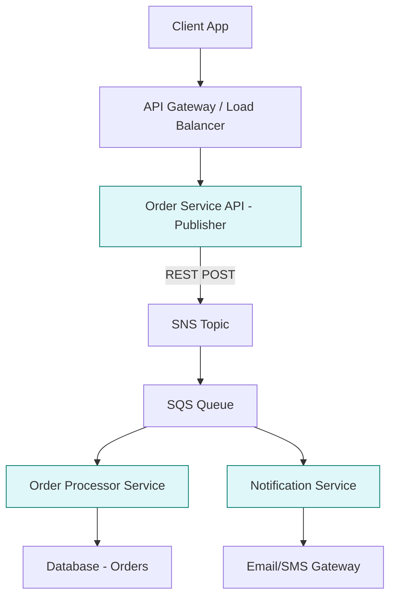
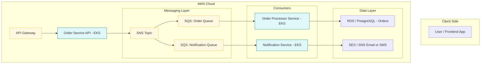

# 📦 Order Hub

A modular, event-driven **Spring Boot** microservices architecture that simulates stock order processing using **REST APIs**, **AWS SNS/SQS**, and **LocalStack** for local development and testing.

<details> <summary>📊 Flow Diagram</summary>


</details>

<details> <summary>📊 Deployment Diagram</summary>


</details>

## 📁 Project Structure

```

orderhub/
├── commons/                     # Shared library (DTOs, utility classes)
│   └── shared-lib/
├── services/
│   ├── order-api/               # REST API to place stock orders (publishes to SNS)
│   └── notification-service/    # SQS consumer that listens for order events
├── scripts/                     # Dev helper scripts (LocalStack, JWT, etc.)
├── docker-compose.yml           # LocalStack setup
├── Makefile                     # One-liner dev commands
└── settings.gradle

```

## 🚀 Features

- 🔄 **Order API (REST)** – Accepts HTTP `POST` requests and publishes order events to AWS SNS.
- 📬 **Notification Service** – Subscribes to SNS via SQS and processes incoming order messages.
- 💻 **LocalStack Support** – Emulates AWS services for local dev and testing.
- 🔧 **Shared Module** – Common DTOs and utils across services.
- 🧪 **Testable Design** – Unit and integration test support via JUnit 5 and Mockito.
- 🔒 **Spring Boot 3.x**, **Java 17**, **Gradle**

## 🛠️ Tech Stack

| Layer      | Technology                 |
| ---------- | -------------------------- |
| Language   | Java 17                    |
| Framework  | Spring Boot 3.x            |
| API Layer  | REST (Spring Web)          |
| Messaging  | AWS SNS + SQS (LocalStack) |
| Build Tool | Gradle                     |
| Containers | Docker + Docker Compose    |


## 🚧 Setup Instructions

### 1️⃣ Prerequisites

- Java 17
- Docker
- `make` (optional, for dev automation)


### 3️⃣ Start LocalStack Infrastructure

```bash
make infra.up        # or docker-compose up -d
make init.sqs        # initializes SNS topics and SQS queues
```

### 4️⃣ Run Services Locally

```bash
make run.order-api         # REST API to place orders
make run.notification      # Worker that listens to SQS
```


## 🧪 Test the Order Flow

### ➕ Place an Order (REST API)

```bash
curl -X POST http://localhost:8080/api/orders \
  -H 'Content-Type: application/json' \
  -d '{
    "userId": "user-123",
    "symbol": "AAPL",
    "quantity": 100,
    "type": "BUY"
  }'
```

### 🔄 Expected Flow:

1. `order-api` receives the REST request.
2. Publishes message to SNS (`order-topic`).
3. SNS fan-outs to SQS (`notification-queue`).
4. `notification-service` picks up and logs/handles the order.


## 🧪 Run All Tests

```bash
./gradlew test
```

## 📌 TODOs

* 🗃️ Add database persistence (e.g., PostgreSQL or DynamoDB)
* 🔐 Add JWT authentication & authorization
* 📈 Add metrics via Micrometer + Prometheus
* 🔁 Add retry and DLQ handling for SQS consumers
* 🔍 Add OpenAPI/Swagger for API documentation
